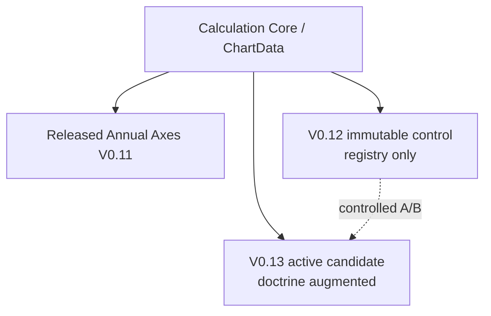

# Annual Axes architecture (canonical)

**STATUS: CURRENT**
**Owner of “current Annual Axes version” claims.**
Other docs should link here instead of restating long formulas.

Verified against live code after PR #244 lineage cleanup.

## A. Production status

| School | Released engine | Entry |
| --- | --- | --- |
| Nam Phái | **`0.11.0`** experimental / uncalibrated | `modules/annual-axes/released-router.ts` → `v0.10-layered/release-adapter.ts` → `analyzeAnnualAxesNamPhaiV10` |
| Trung Châu | **`0.2.0`** | `modules/annual-axes/analyze.ts` (legacy path) |

UI badge: **V0.11 EXP**.
Contracts: `getAnalysisStatus("annual-axes", { school: "nam-phai" })` → `0.11.0`.

Candidate id: `CANDIDATE-AAV11-DOMAIN-ENGINE`.
Module id string: `annual-axes-v0.11-domain-engine`.

**Knowledge path quirk:** V0.11 constants live under `knowledge/annual-axes/v0.10/`
(historical folder; version strings are `0.11.0`). See [Naming debt](#naming-debt).

## B. Version lineage table

| Version | Role | Runtime status | Mutable? | Doctrine | Production |
| --- | --- | --- | --- | --- | --- |
| V0.8 | Frozen kernel / annual-trigger mechanics | shared / frozen (`nam-phai-v08/`) | no | no | indirect (kernel) |
| V0.10 | Historical layered lineage | **HISTORICAL_RUNTIME_DEPENDENCY** via `v0.10-layered/` | do not reopen research | romance-semantic research-only | no |
| V0.11 | Released Annual Axes | **RELEASED** | release-frozen | no PO numeric input | **YES** |
| V0.12 | Immutable research control | research control | **NO** (same identity) | **none** | no |
| V0.13 | Doctrine-augmented candidate | **ACTIVE_RESEARCH** | until decision freeze | versioned VERIFIED_PRIMARY bridge | no |



## C. Four-layer model (released V0.11)

Layers (all **domain** signals — never Palace Overview scores):

| Layer | Weight (`layered-balanced`) | Authority |
| --- | --- | --- |
| Natal Foundation | **0.30** | Engineering hypothesis / domain-engine static |
| Major Fortune | **0.25** | MF ordinal projected to domains |
| Annual Trigger | **0.35** | V0.8 annual domain kernel |
| Resonance | **0.10** | Engineering interaction policy |

These weights are **ENGINEERING_POLICY**, not classical doctrine.

### Released data flow

```text
ChartData
   ├── Natal Foundation   (domain-engine + AnnualDomainProjection + V0.8 natal rules)
   ├── Major Fortune      (adapt-major-fortune)
   ├── Annual Trigger     (adapt-annual-trigger / V0.8 score-domain)
   └── Resonance
        │
        ▼
weighted compose (v0.10-layered/compose)
        │
        ▼
frozen V0.8 tanh normalization
        │
        ▼
six Annual Axes (health, family, wealth, career, social, romance)
```

## D. Domain projection

Knowledge: `knowledge/annual-axes/v0.10/domain-projection.json`
Semantics: **AnnualDomainProjection** — relevance of natal palaces to a
life-domain analysis. Nature: `ENGINEERING_HYPOTHESIS`.

Not: PalaceScoreProjection / contribution of Palace Overview scores.

## E. V0.12 — immutable registry-only control

| Field | Value |
| --- | --- |
| engine / knowledge | `0.12.0` |
| candidate | `CANDIDATE-AAV12-CALIBRATED-DOMAIN-SIGNALS` |
| formula | `v0.12-static-direction-activation-role-compose` |
| referenceMass | **4** (selected) |
| doctrine fallback | **NONE** (`doctrine-fallback.ts` removed in #244) |

Flow:

```text
physical/static natal facts
  → V0.12 registry scoring
  → direction
  → activation damping (referenceMass)
  → per-palace aggregation
  → domain natal signal
  → (same layered decade/annual/resonance compose primitives for research A/B)
```

**Why immutable:** V0.13’s A/B baseline. Changing V0.12 under the same
`0.12.0` identity invalidates published decisions/corpus (lesson from #242→#244).

## F. V0.13 — sole doctrine-augmented candidate

| Field | Value |
| --- | --- |
| engine / knowledge | `0.13.0` |
| candidate | `CANDIDATE-AAV13-DOCTRINE-AUGMENTED-STATIC` |
| formula | `v0.13-v12-static-plus-doctrine-fallback` |
| productionImpactAllowed | **false** |

Flow:

```text
V0.12 physical/static evidence
  │
  ├─ evidence exists for star → V0.12 wins (no doctrine numeric)
  │
  └─ missing physical-star direction
       ↓
     versioned doctrine bridge (knowledge/annual-axes/v0.13/)
       ↓
     VERIFIED_PRIMARY + EXACT_SECTION locator
       ↓
     natal/static condition resolution (fail closed)
       ↓
     engineering ordinal mass (weak/moderate/strong → 1/2/3; unspecified → null)
       ↓
     fallback evidence
```

Invariants:

- Doctrine conditions resolve from **natal/static** context only
- Annual / monthly / Major Fortune facts cannot satisfy natal doctrine
- Branch conditions use physical natal palace
- Transformation conditions use natal transformation facts
- Source claims keep `numericDelta = null`
- Ordinal → mass is **ENGINEERING RESEARCH POLICY**

V0.13 **does not** numerically consume `PalaceOverviewResult`, PO score, or
`rawAxes`.

## G. Palace Overview boundary

```text
ANNUAL_AXES_PALACE_OVERVIEW_NUMERIC_DEPENDENCY = ZERO
```

Enforced by import-boundary tests and domain-engine independence tests.
Romance-semantic tooling under `v0.10-layered/romance-semantic/` is
**research explainability only** and is excluded from production import walks.

## H. Forbidden dependencies (Annual Axes)

| From | Must not |
| --- | --- |
| Released AA | import V0.12/V0.13 analyzers; read `.research-artifacts` |
| V0.12 | depend on V0.13; host doctrine fallback |
| V0.13 runtime | import Palace Overview analyzers |
| Any AA numeric | consume PO score / rawAxes / PalaceOverviewResult |
| Monthly Flow | contaminate natal static foundation |

## I. Research scripts

```bash
npm run research:annual-axes-v011:validate
npm run research:annual-axes-v012:validate
npm run research:annual-axes-v013:validate
```

Artifacts under `.research-artifacts/` (gitignored). Decisions:
`research/annual-axes/v0.12/decision.md`, `v0.13/decision.md`.

## Naming debt

| Path | Current role | Why not renamed in docs PR |
| --- | --- | --- |
| `modules/annual-axes/v0.10-layered/` | **HISTORICAL_RUNTIME_DEPENDENCY** — hosts released V0.11 layered compose + adapters | Wide import surface; rename needs dedicated refactor |
| `knowledge/annual-axes/v0.10/` | Stores **0.11.0** profile/projection constants | Same; version strings are authoritative |
| Function `analyzeAnnualAxesNamPhaiV10` | Implements **V0.11** released engine | API rename = breaking churn |

**Do not delete** `v0.10-layered/` because “V0.10 is old.”
