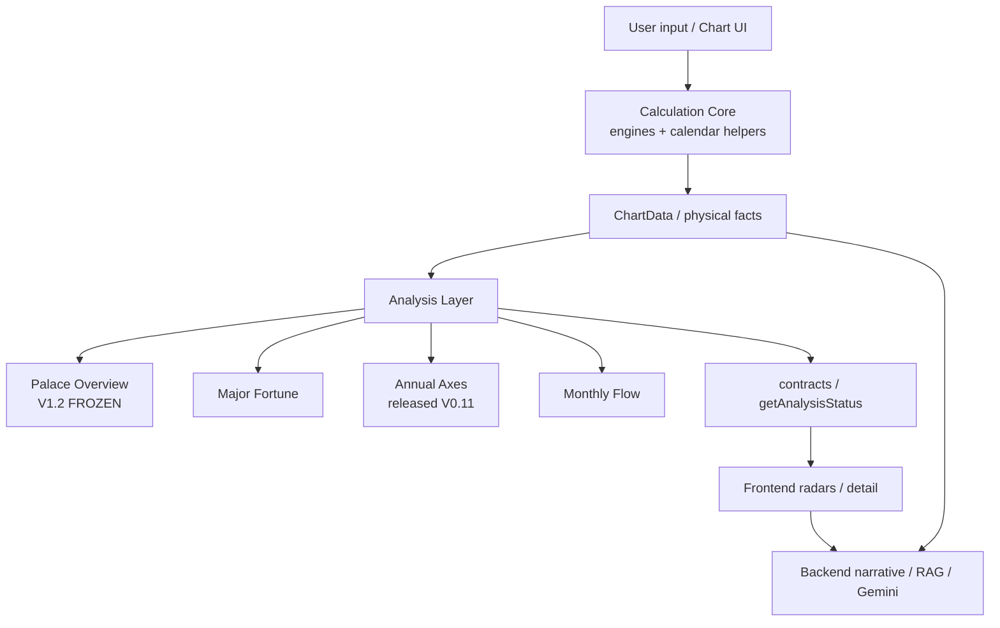

# Zi Wei system architecture

**STATUS: CURRENT**
**Verified against:** `master` @ post-#244 (`633bc21`)

## System diagram



Arrow meanings:

- **runtime dependency** — Calculation → Analysis consumes `ChartData`
- **presentation** — Analysis contracts feed UI
- **narrative** — Backend interprets; it does **not** set scoring authority

## Calculation Core

**Paths (physical / calendar / chart facts only):**

| Path | Role |
| --- | --- |
| `src/lib/ziwei/engine-nam-phai.ts` | Nam Phái chart calculation |
| `src/lib/ziwei/engine-trung-chau.ts` | Trung Châu chart calculation |
| `src/lib/ziwei/chart.ts` | Typed chart adapter for UI |
| `src/lib/ziwei/calculation/` | Supporting placement helpers (e.g. major-fortune mutagens) |
| `src/lib/ziwei/annual-flow.ts` | Annual flow physical helpers |
| `src/lib/calendar/` | Shared calendar / astronomy math |
| `src/lib/ziwei/star-classification.ts` | Physical star class / annual identity helpers |

Calculation Core **emits** natal structure, palaces, indices, stems/branches,
stars, brightness, natal/annual transformations, Major Fortune placement,
annual head / temporal placements, void markers, physical relationships.

Calculation Core **must not**:

- interpret biography or relationship outcomes
- invent doctrine or human narrative
- import research decisions or `.research-artifacts`
- calibrate toward known user outcomes
- depend on Analysis modules

## Analysis Core

**Path:** `src/lib/ziwei/analysis/`

Consumes chart facts + versioned knowledge → analytic evidence / results.

Sibling products (independent numeric scopes):

| Module | Production status |
| --- | --- |
| Palace Overview | **V1.2 FROZEN** |
| Annual Axes (Nam Phái) | **V0.11 EXP** released experimental |
| Annual Axes (Trung Châu) | **V0.2** |
| Major Fortune | ordinal runtime (see module README) |
| Monthly Flow | stable production path + gated V1 candidate |

See [`ziwei-analysis.md`](./ziwei-analysis.md).

## Frontend / backend

| Layer | Path | Authority |
| --- | --- | --- |
| Frontend visualization | `src/components/ziwei/**` | Displays analysis contracts; must not invent scores |
| Backend narrative / RAG | `backend/app/kb/`, FastAPI + Gemini | **Narrative only** unless claims are formally ingested into analysis knowledge |

A prose file under `backend/app/kb/` is **not** Calculation/Analysis doctrine
merely because it contains a rule-looking sentence.

## Forbidden collapse

```text
Palace Overview.score / rawAxes  ──✗──▶  Annual Axes domain numeric
Backend KB prose                 ──✗──▶  Calculation / Analysis scores
Research candidate               ──✗──▶  Released router (without release PR)
```
