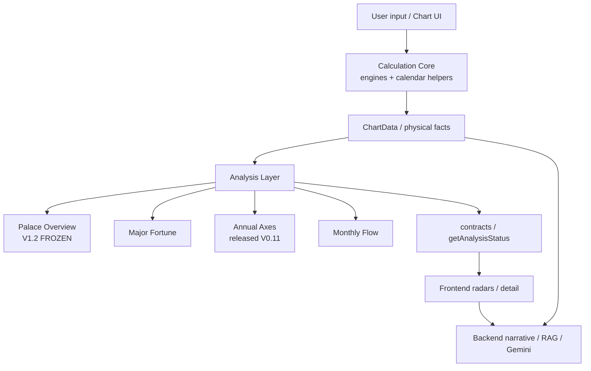

# Zi Wei system architecture

**STATUS: CURRENT**
**Verified against:** `master` @ post-#262 Trung Châu Mậu/Nhâm Khoa correction
+ PR #263 temporal-contract hardening

## System diagram



Arrow meanings:

- **runtime dependency** — Calculation → Analysis consumes `ChartData`
- **presentation** — Analysis contracts feed UI
- **narrative** — Backend interprets; it does **not** set scoring authority

## Calculation Core

**Paths (physical / calendar / chart facts only):**

| Path | Role |
| --- | --- |
| `src/lib/ziwei/engine-nam-phai.ts` | Nam Phái algorithms + orchestration (**stateless**) |
| `src/lib/ziwei/engine-trung-chau.ts` | Trung Châu algorithms + orchestration (**stateless**) |
| `src/lib/ziwei/schools/nam-phai-policy.ts` | Nam static policy (Tứ Hóa, Khôi/Việt) |
| `src/lib/ziwei/schools/trung-chau-policy.ts` | TC static policy (Tứ Hóa, Khôi/Việt) |
| `src/lib/ziwei/schools/policy-types.ts` | Compile-time TuHoa/KhoiViet contracts + stem lookup helpers |
| `src/lib/ziwei/schools/policy-registry.ts` | Data-only `School` → static policy tables |
| `src/lib/ziwei/calculation/shared-primitives.ts` | School-neutral constants + star insertion |
| `src/lib/ziwei/calculation/shared-chart-geometry.ts` | Cục / Mệnh-Thân / Major Fortune / void geometry |
| `src/lib/ziwei/calculation/shared-temporal.ts` | Annual-flow geometry (not school annualPalace) |
| `src/lib/ziwei/calculation/shared-mutagens.ts` | Table-injected Tứ Hóa / phi-flow mechanics |
| `src/lib/ziwei/calculation/resolve-major-fortune-mutagens.ts` | Đại Vận mutagens via policy registry (no `getEngine`) |
| `src/lib/ziwei/calculation-input.ts` | Raw form → validated calculation input boundary |
| `src/lib/ziwei/chart.ts` | Typed chart adapter for UI |
| `src/lib/ziwei/calculation/` | Other placement helpers |
| `src/lib/ziwei/annual-flow.ts` | Annual flow physical helpers (SSOT) |
| `src/lib/calendar/` | Shared calendar / astronomy math |
| `src/lib/ziwei/star-classification.ts` | Physical star class / annual identity helpers |

**Ownership layers (PR #256 / #257):**

```text
shared deterministic mechanics  ≠  school policy  ≠  school algorithms  ≠  school orchestration
```

- Shared modules must not contain `if (school === …)`.
- School policy tables are typed (`satisfies TuHoaTable` / `KhoiVietTable`) and
  routed only through `getZiweiStaticSchoolPolicy` or direct school imports.
- Mutagen resolution shares table-injected helpers; `addMutagenStars` stays
  school-local (Nam annual `Lưu `; TC `ĐV` major prefix).
- School differences (Canh Tứ Hóa, Khôi/Việt, Linh direction, Bác Sĩ direction,
  annualPalace / tiểu hạn, TC trùng bài / signature / majorMutagens) are locked by
  `src/lib/ziwei/__tests__/school-boundaries.test.ts` and
  `src/lib/ziwei/__tests__/policy-mutagen-characterization.test.ts`.
- Both school engines remain the calculation entry boundaries (`calculate`,
  `calculateForAnnualYear`, ChartEngine exports).

**Runtime ownership (PR #249):**

- `calculate(input)` is pure w.r.t. module state — **no** `lastData` / `getData`.
- React `chartData` (caller) owns the displayed chart SSOT.
- AI serialization must use that same `chartData`, never an engine singleton.
- Malformed inputs fail at the validation boundary; Calculation Core must not
  invent plausible defaults (host current year, UTC+7, Tý, cast `flowBase`).

Calculation Core **emits** natal structure, palaces, indices, stems/branches,
stars, brightness, natal/annual transformations, Major Fortune placement,
annual head / temporal placements, void markers, physical relationships.

Calculation Core **must not**:

- interpret biography or relationship outcomes
- invent doctrine or human narrative
- import research decisions or `.research-artifacts`
- calibrate toward known user outcomes
- depend on Analysis modules
- store chart results in module-global mutable state

## Analysis Core

**Path:** `src/lib/ziwei/analysis/`

Consumes chart facts + versioned knowledge → analytic evidence / results.

Sibling products (independent numeric scopes):

| Module | Production status |
| --- | --- |
| Palace Overview | **V1.2 FROZEN** |
| Annual Axes (Nam Phái) | **V0.11 EXP** released experimental |
| Annual Axes (Trung Châu) | **V0.2** |
| Major Fortune | ordinal runtime (see module README) |
| Monthly Flow | stable production path + gated V1 candidate |

See [`ziwei-analysis.md`](./ziwei-analysis.md).

## Frontend / backend

| Layer | Path | Authority |
| --- | --- | --- |
| Frontend visualization | `src/components/ziwei/**` | Displays analysis contracts; must not invent scores |
| Backend narrative / RAG | `backend/app/kb/`, FastAPI + Gemini | **Narrative only** unless claims are formally ingested into analysis knowledge |

### API transport contract SSOT (PR #251)

```text
Calculation Core (ChartData)
  → serializeChart()
  → ApiChartDto
  → HTTP

Pydantic schemas (backend/app/schemas.py, api_errors.py)
  → OpenAPI (backend/openapi.json)
  → generated TS (src/generated/api-schema.ts)
  → aliases (src/api/contracts.ts)
```

**Transport schema authority ≠ Calculation authority.**

- `API_TRANSPORT_SCHEMA_AUTHORITY = FASTAPI_PYDANTIC`
- `ASTROLOGY_CALCULATION_AUTHORITY = TYPESCRIPT_CALCULATION_CORE`
- `BACKEND_ZIWEI_PLACEMENT_CALCULATION = ZERO`

When changing ChartDTO: edit Pydantic → `npm run api:generate` → review diffs →
update fixtures/tests → commit artifacts. CI runs `npm run api:check`.

**Narrative school capability (PR #249):**

| Chart school | Narrative |
| --- | --- |
| `nam-phai` | Supported — KB under `backend/app/kb/data/nam_phai/` + Nam Phái system prompt |
| `trung-chau` | **Unsupported** until a verified Trung Châu KB pack exists (`UNSUPPORTED_NARRATIVE_SCHOOL`) |

Never map `trung-chau` → Nam Phái KB. Chart calculation for Trung Châu remains
valid; only AI narrative is blocked.

A prose file under `backend/app/kb/` is **not** Calculation/Analysis doctrine
merely because it contains a rule-looking sentence.

### Multi-year temporal snapshots (PR #250)

```text
User Question
    ↓
Backend Year Resolver (anchor = chart.annualYear)
    ↓
Snapshot Negotiation (HTTP 409 TEMPORAL_SNAPSHOTS_REQUIRED)
    ↓
Frontend TS Calculation Core (calculateForAnnualYear)
    ↓
ChartDTO Temporal Bundle
    ↓
Backend Identity Validation
    ↓
Year-Isolated Focus
    ↓
School KB
    ↓
LLM Narrative
```

**`BACKEND_ZIWEI_PLACEMENT_CALCULATION = ZERO`**

Python must not compute Lộc Tồn / Tứ Hóa / Tiểu Hạn / annual stars for foreign
years. Backend annual placement calculation is **absent**
(`PYTHON_ANNUAL_PLACEMENT_IMPLEMENTATION = ABSENT`); former `annual_stars.py`
was removed as runtime-dead (PR #255).

Ordinary non-temporal questions still use a single request and the anchor chart only.

## Forbidden collapse

```text
Palace Overview.score / rawAxes  ──✗──▶  Annual Axes domain numeric
Backend KB prose                 ──✗──▶  Calculation / Analysis scores
Research candidate               ──✗──▶  Released router (without release PR)
```

## Temporal coordinates (monthly)

Two independent systems must not be collapsed:

| Coordinate | Authority |
| --- | --- |
| Monthly focus palace | `FlowMonthEntry.palace` (placement geometry) |
| Monthly calendar Can–Chi | `stemBranchForLunarMonth(annualStem, lunarMonth)` |

`FlowMonthEntry.stem` / `FlowMonthEntry.branch` are **legacy palace-derived
compatibility metadata**. They are **not** calendar Can/Chi. Monthly Flow
resolves calendar identity only through the Calculation Core provider.
Removal of the legacy fields is deferred (RQ-TC-012).

Annual Axes module visibility is gated by `isAnnualAxesEnabled()` inside
`getAnalysisStatus("annual-axes")` (same kill-switch posture as other modules).
